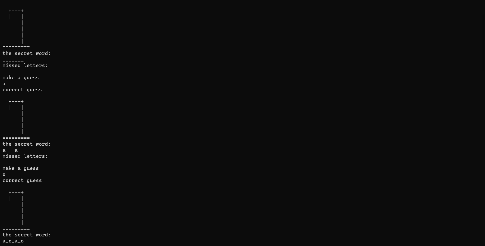
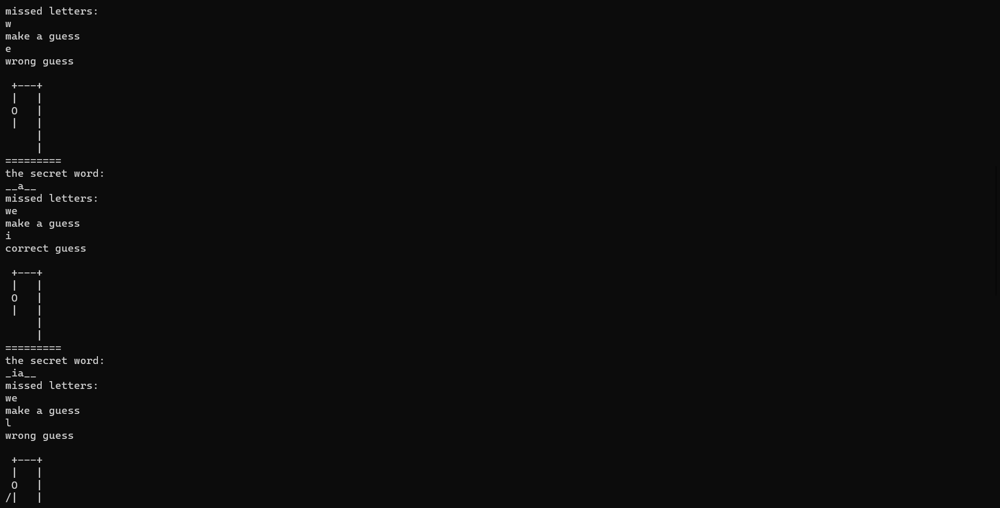
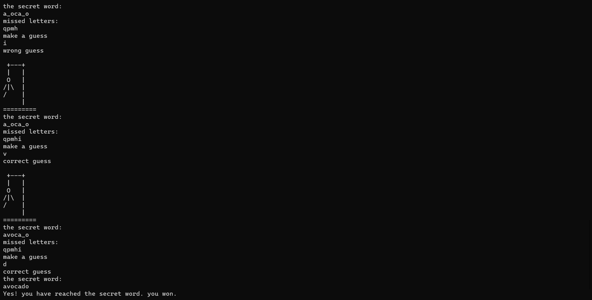

# משחק איש תלוי
## כללי המשחק
מטרת המשחק היא לנחש את המילה שנבחרה, המשחק יציג שורה של רווחים שמייצגים את המילה הנסתרת.<br>
בכל שלב, המשתמש מנחש אות שקיימת במילה,<br>
אם האות מופיעה במילה שנבחרה - תיחשף האות בכל המקומות בהם היא מופיעה במילה,<br>
ואילו, אם האות שגויה - דמותו של האיש התלוי תתחיל להתהוות, והאות השגויה תירשם בצד.<br>
המשחק מסתיים כאשר דמותו של האיש התלוי נחשפה - סך הכל 6 ניחושים שגויים.<br>
אך אם הצלחתם לנחש את המילה שלפניה - ניצחתם 🏅<br>

## התקנה
ראשית הורד את הקובץ למחשב המקומי שלך על ידי הפקודה הבאה בשורת הפקודה של התיקייה הרצויה:

```bash
git clone https://github.com/shirabiton/hang-man-game.git
```
הרץ את הקובץ main.py (לחץ על "run"), והתחל במשחק 🏁


## איך זה נראה בפועל



 <br><br>


