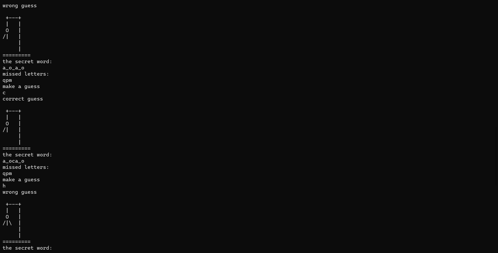

# Hangman Game
## Overview
The figure of the hanging man is drawn with simple keyboard symbols in code, like this:

```
  +---+
  |   |
  O   |
 /|\  |
 / \  |
      |
=========
```

At this point, you can only play on the project's console.
## Game Rules
The aim of the game is to guess the chosen word, the game will display a series of spaces that represent the hidden word.<br>
At each step, the user will guess a letter that exists in the word,<br>
if the letter appears in the selected word - the letter will be revealed in all the places where it appears in the word.<br>
Whereas, if the letter is wrong - the figure of the hanged man will begin to form, and the wrong letter will be written on the side.<br>
The game ends when the figure of the hanged man is revealed - a total of 6 wrong guesses.<br>
But if you managed to guess the word before - you won 🏅<br>
## Use Of Technologies
- Python language.
## Installation
First clone the file to your local computer by the following command in the command line of the desired folder:
```bash
git clone https://github.com/shirabiton/hang-man-game.git
```
Run the file main.py, and start the game 🏁<br>
## So what does it actually look like?



 <br><br>


